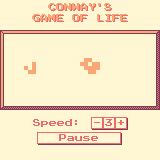

Conway's Game of Life
====

The classical Conway's game of life cellular automation

<https://gitlab.com/claudiomattera/game-of-life/>

Implementation
----

This game is implemented in [Rust] using the toolkit [WASM-4].

The game can be embedded in a web page using [WebAssembly].
A standalone cartridge can be created with the following commands.

~~~~bash
cargo build --release
w4 bundle target/wasm32-unknown-unknown/release/cosmo-fighter.wasm
      --title "Conway's Game of Life"
      --description "The classical Conway's game of life cellular automation"
      --timestamp
      --html ./cartridge.html
~~~~

[Rust]: https://www.rust-lang.org/
[WASM-4]: https://wasm4.org/
[WebAssembly]: https://webassembly.org/

License
----

Copyright Claudio Mattera 2021

You are free to copy, modify, and distribute this application with attribution under the terms of the [MPL 2.0 license]. See the [`License.txt`](./License.txt) file for details.

[MPL 2.0 license]: https://opensource.org/licenses/MPL-2.0
